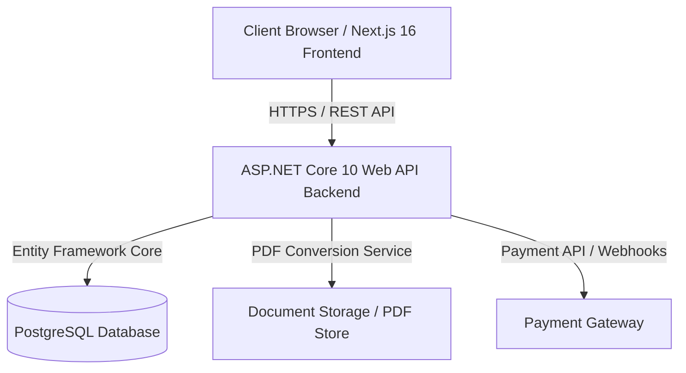

# 🎓 University Club Management System (UCMS)

[](https://dotnet.microsoft.com/)
[](https://nextjs.org/)
[](https://www.postgresql.org/)
[](LICENSE)

A full-stack, enterprise-ready web platform for managing university clubs, student memberships, event organizing, ticket registrations (free & paid), administrative document verification, and club announcements.

---

## 📌 Table of Contents

- [Overview](#-overview)
- [Key Features](#-key-features)
- [System Architecture](#-system-architecture)
- [Technology Stack](#-technology-stack)
- [Project Directory Structure](#-project-directory-structure)
- [Role-Based Workflows](#-role-based-workflows)
- [Getting Started](#-getting-started)
- [Environment Configuration](#-environment-configuration)
- [Documentation & Requirements](#-documentation--requirements)

---

## 📸 Overview

The **University Club Management System (UCMS)** simplifies administrative overhead for university clubs by centralizing user authentication, club creation, student identity verification, event publishing, payment session management, and official announcements into a unified dashboard.

---

## ✨ Key Features

- 🔒 **Secure Authentication**: Role-Based Access Control (RBAC) with JWT and Refresh Tokens.
- 🪪 **Student Verification & ID Conversion**: Students register and upload proof of student identity (PDF/JPG/PNG). Image uploads are automatically converted into PDF documents before secure storage.
- 🛡️ **Admin Approval Workflow**: Accounts remain in `Pending` state until reviewed and approved by System Admins.
- 🎪 **Free & Paid Event Management**: Create, edit, and filter events with capacity limits and deadlines. Integrated payment session support for paid events.
- 💳 **Payment Processing**: Integrated gateway session creation and webhook callback handlers.
- 📢 **Announcements**: Pinned posts and category-filtered announcements for clubs.
- 📊 **Role Dashboards**: Custom metrics for Students, Club Admins, and System Admins.

---

## 🏗️ System Architecture



---

## 🛠️ Technology Stack

### Backend
- **Framework**: ASP.NET Core 10 Web API (C#)
- **Database ORM**: Entity Framework Core 10
- **Database**: PostgreSQL
- **Security**: JWT Bearer Tokens, Refresh Tokens, ASP.NET Identity / Hashed Password Security
- **Documentation**: Swagger / OpenAPI, `.http` test files

### Frontend
- **Framework**: Next.js 16 (App Router) + React 19
- **Language**: TypeScript
- **Styling**: Tailwind CSS + shadcn/ui
- **State & Data Fetching**: TanStack Query (React Query) + Axios
- **Form Validation**: React Hook Form + Zod

---

## 📂 Project Directory Structure

```text
University Club Management system/
├── .gitignore                                   # Global repository Git ignore rules
├── README.md                                    # Master project documentation (this file)
├── University_Club_Management_System_Requirements.md  # Master system requirements & specifications
├── Backend/                                     # Backend architectural workspace
│   ├── README.md                                # Backend overview documentation
│   ├── UCMS_Backend_Requirements.md            # Detailed API specs & schema reference
│   ├── University Club Management Backend.slnx  # .NET Solution file
│   └── University Club Management Backend/      # ASP.NET Core 10 API Web Service project
│       ├── .env                                 # Local environment configuration
│       ├── .gitignore                           # Backend specific git ignore
│       ├── README.md                            # API setup & execution guide
│       ├── Program.cs                           # Application entry point & service wiring
│       ├── appsettings.json                     # System configuration
│       ├── data/                                # EF Core DB Context & Migrations
│       ├── models/                              # Data models & entity schemas
│       └── Properties/                          # Launch settings & profile config
└── Frontend/                                    # Frontend architectural workspace
    ├── README.md                                # Frontend overview & setup guide
    └── UCMS_Fronted_Requirements.md             # UI/UX specifications & page route maps
```

---

## 👥 Role-Based Workflows

1. **Student Workflow**:
   - Register account & upload University ID (JPG/PNG converted to PDF).
   - Await System Admin approval -> Log in upon approval.
   - Browse clubs, apply for memberships, register for events, complete payments, view announcements.

2. **Club Admin Workflow**:
   - Create and manage club profiles.
   - Approve or reject student membership applications.
   - Organize free or paid events, set registration limits, post club announcements.

3. **System Admin Workflow**:
   - Inspect pending student ID documents and approve/reject registrations.
   - Manage global platform users, create clubs, and assign Club Admins.

---

## 🚀 Getting Started

### Prerequisites
- [.NET 10 SDK](https://dotnet.microsoft.com/download)
- [PostgreSQL Database](https://www.postgresql.org/download/)
- [Node.js 20+ & npm](https://nodejs.org/)

### 1. Backend Setup
Navigate into the backend project directory and start the API server:
```bash
cd "Backend/University Club Management Backend"
dotnet restore
dotnet ef database update
dotnet run
```
*The Web API will launch with Swagger documentation enabled at `http://localhost:5000/swagger` or `https://localhost:5001/swagger`.*

### 2. Frontend Setup
Navigate into the frontend folder:
```bash
cd Frontend
npm install
npm run dev
```

---

## 📄 Documentation & Requirements

- [Master System Requirements](file:///e:/University%20Club%20Management%20system/University_Club_Management_System_Requirements.md)
- [Backend Requirements & API Reference](file:///e:/University%20Club%20Management%20system/Backend/UCMS_Backend_Requirements.md)
- [Frontend Requirements & Route Structure](file:///e:/University%20Club%20Management%20system/Frontend/UCMS_Fronted_Requirements.md)
