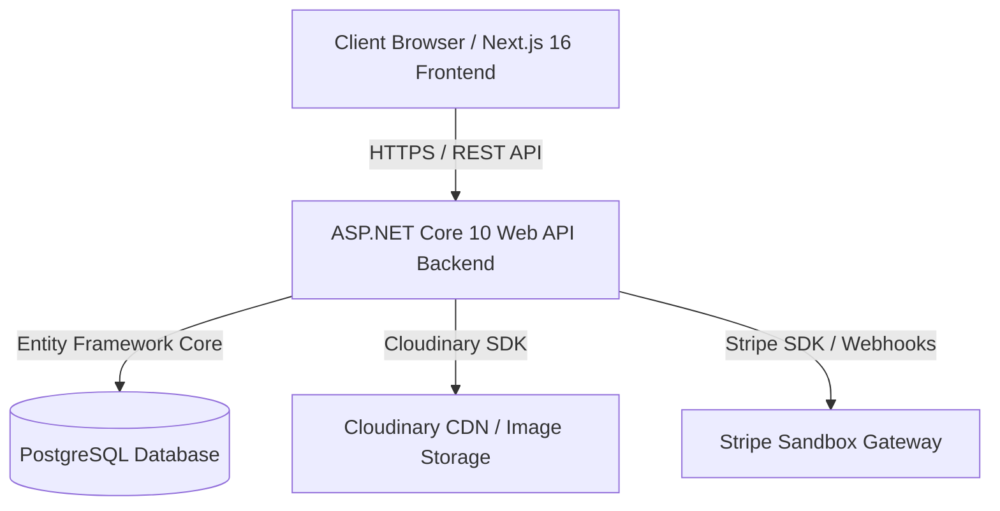

# 🎓 University Club Management System (UCMS)

[](https://dotnet.microsoft.com/)
[](https://nextjs.org/)
[](https://www.postgresql.org/)
[](https://stripe.com/)
[](LICENSE)

A full-stack, enterprise-ready web platform for managing university clubs, student memberships, event organizing, ticket registrations (free & paid with Stripe Sandbox integration), student identity document verification via Cloudinary CDN, in-app notifications, and club announcements.

---

## 📌 Table of Contents

- [Overview](#-overview)
- [Key Features](#-key-features)
- [System Architecture](#-system-architecture)
- [Technology Stack](#-technology-stack)
- [Project Directory Structure](#-project-directory-structure)
- [Role-Based Workflows](#-role-based-workflows)
- [Getting Started](#-getting-started)
- [Environment Configuration](#-environment-configuration)
- [Documentation & Requirements](#-documentation--requirements)

---

## 📸 Overview

The **University Club Management System (UCMS)** simplifies administrative overhead for university clubs by centralizing user authentication, club creation, student identity verification, event publishing, Stripe payment session management, in-app notifications, and official announcements into a unified dashboard.

---

## ✨ Key Features

- 🔒 **Secure Authentication**: Role-Based Access Control (RBAC) with JWT Bearer Tokens, Refresh Tokens, Cookie handling, and role-based post-login redirection (`ClubAdmin` -> `/club-admin`, `Admin` -> `/admin`, `Student` -> `/dashboard`).
- 🪪 **Student Identity Verification**: Students register by submitting their student ID number and uploading their student ID card photo directly to **Cloudinary CDN**.
- 🛡️ **Admin Student Approval**: Student accounts remain in `Pending` verification state until reviewed and approved by Admins using the uploaded ID photo.
- 🏛️ **Club Creation Application & Admin Approval**: Users can apply to form a new club with description and logo image upload. Admins review and approve/reject club creation requests (auto-promoting applicant to ClubAdmin upon approval).
- 🤝 **Club Memberships**: Students can apply to join active clubs and leave clubs. Club admins approve or reject requests with feedback.
- 📅 **Club Events Management**: Public event catalog for students and dedicated managed events endpoint (`/api/events/managed`) for Club Admins to view and manage only events created by their own clubs.
- 💳 **Stripe Sandbox Payments**: Integration with Stripe Checkout Sessions (`Stripe.net`), confirmation callbacks, paid event registrations, and itemized payment history lookup (`/dashboard/payments`).
- 🔔 **In-App Notifications**: Real-time notification feed, unread count badges, mark as read, deletion, and club-wide broadcasts sent by Club Admins to all members.
- 📢 **Announcements**: Pinned posts and bulletin management.
- 📊 **Tailored Dashboard APIs**: Customized analytics endpoints for Students, Club Admins, and System Admins.
- 🌱 **Automated Database Seeding & EF Migrations**: Pre-configured system accounts (SystemAdmin, Admin, ClubAdmins, Verified/Pending Students) auto-seeded on startup.

---

## 🏗️ System Architecture



---

## 🛠️ Technology Stack

### Backend
- **Framework**: ASP.NET Core 10 Web API (C# 13)
- **Database ORM**: Entity Framework Core 10
- **Database**: PostgreSQL
- **Cloud Media Storage**: Cloudinary (`CloudinaryDotNet`)
- **Payments Gateway**: Stripe Sandbox (`Stripe.net`)
- **Security**: JWT Bearer Tokens, Refresh Tokens, BCrypt Password Hashing
- **Documentation & Testing**: Swagger / OpenAPI, `.http` API reference file

### Frontend
- **Framework**: Next.js 16 (App Router) + React 19
- **Language**: TypeScript
- **Styling**: Tailwind CSS + shadcn/ui
- **State & Data Fetching**: TanStack Query (React Query) + Axios
- **Form Validation**: React Hook Form + Zod

---

## 📂 Project Directory Structure

```text
University Club Management system/
├── .gitignore                                   # Global repository Git ignore rules
├── README.md                                    # Master project documentation (this file)
├── University_Club_Management_System_Requirements.md  # Master system requirements & specifications
├── Backend/                                     # Backend architectural workspace
│   ├── README.md                                # Backend overview documentation
│   ├── UCMS_Backend_Requirements.md            # Detailed API specs & schema reference
│   └── University Club Management Backend/      # ASP.NET Core 10 API Web Service project
│       ├── .env                                 # Local environment configuration (DB, Cloudinary, Stripe)
│       ├── .gitignore                           # Backend specific git ignore
│       ├── README.md                            # API setup & execution guide
│       ├── Program.cs                           # Application entry point & service wiring
│       ├── appsettings.json                     # System configuration
│       ├── data/                                # EF Core Context, Seed.cs & Migrations
│       ├── models/                              # Data models (User, StudentVerification, Club, Membership, Payment, Notification)
│       ├── Dtos/                                # Data Transfer Objects by module
│       ├── modules/                             # Feature modules (auth, student-verification, user, club, membership, payment, notification, dashboard)
│       └── UniversityClubManagement.http        # Interactive REST API test suite (9 Complete Sections)
└── Frontend/                                    # Frontend architectural workspace
    ├── README.md                                # Frontend overview & setup guide
    └── UCMS_Fronted_Requirements.md             # UI/UX specifications & page route maps
```

---

## 👥 Role-Based Workflows

1. **Student Workflow**:
   - Register account with Student ID number & Student ID card photo upload to Cloudinary (no role parameter required).
   - Await Admin review & approval of ID card photo.
   - Upon approval, log in and access student dashboard, browse active clubs, apply to join/leave clubs, receive notifications, register for events, and complete payments via Stripe Checkout.

2. **Club Admin Workflow**:
   - Apply to create a new club or be promoted upon club approval.
   - Manage club details, description, and logo.
   - Approve or reject student membership applications.
   - Broadcast notifications to all active club members.
   - Organize free or paid events, set registration limits, post club announcements.

3. **System Admin Workflow**:
   - Inspect pending student verification requests with ID card photos and approve/reject.
   - Review pending club creation applications and approve/reject (auto-promotes owner to ClubAdmin).
   - Manage global platform users, roles, delete users/clubs, and view overall system analytics.

---

## 🚀 Getting Started

### Prerequisites
- [.NET 10 SDK](https://dotnet.microsoft.com/download)
- [PostgreSQL Database](https://www.postgresql.org/download/)
- [Node.js 20+ & npm](https://nodejs.org/)

### 1. Backend Setup
Navigate into the backend project directory and start the API server:
```bash
cd "Backend/University Club Management Backend"
dotnet restore
dotnet ef database update
dotnet run
```
*The Web API will launch with Swagger documentation enabled at `http://localhost:5000/swagger` or `https://localhost:5001/swagger`.*

### 2. Frontend Setup
Navigate into the frontend folder:
```bash
cd Frontend
npm install
npm run dev
```

---

## 📄 Documentation & Requirements

- [Master System Requirements](file:///e:/University%20Club%20Management%20system/University_Club_Management_System_Requirements.md)
- [Backend Requirements & API Reference](file:///e:/University%20Club%20Management%20system/Backend/UCMS_Backend_Requirements.md)
- [Frontend Requirements & Route Structure](file:///e:/University%20Club%20Management%20system/Frontend/UCMS_Fronted_Requirements.md)
